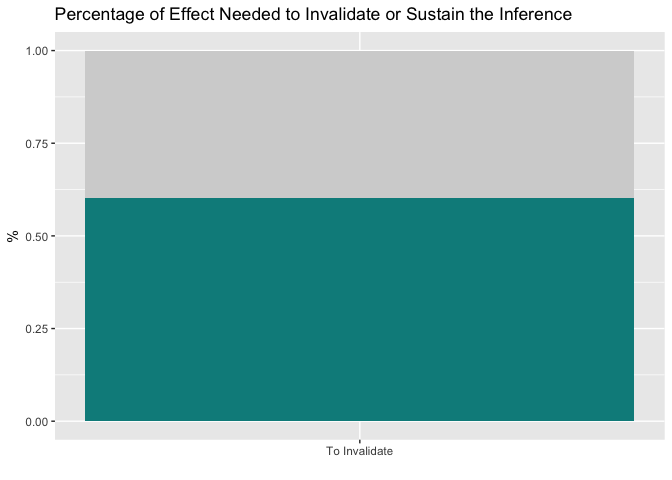

<!-- README.md is generated from README.Rmd. Please edit that file -->
konfound
========

The goal of konfound is to carry out sensitivity analysis as described in Frank, Maroulis, Duong, and Kelcey (2013) based on Rubin's (1974) causal model.

Installation
============

You can install konfound from GitHub with:

``` r
# install.packages("devtools")
devtools::install_github("jrosen48/rsensitivity")
```

``` r
devtools::load_all(".")
#> Loading konfound
```

Use of konfound
===============

### pkonfound() for published studies

`pkonfound()`, for published studies, calculates (1) how much bias there must be in an estimate to invalidate/sustain an inference; (2) the impact of an omitted variable necessary to invalidate/sustain an inference for a regression coefficient:

``` r
library(konfound)
```

``` r
pkonfound(2, .4, 100, 3, to_return = "df")
#> # A tibble: 1 x 3
#>       inference percent_bias replace_null_cases
#>           <chr>        <dbl>              <dbl>
#> 1 to_invalidate         60.3                 60
pkonfound(2, .4, 100, 3, to_return = "print")
#> To invalidate the inference, 60.3 % of the estimate would have to be due to bias.
#> To invalidate the inference, 60 observations would have to be replaced with cases for which there is no effect.
pkonfound(2, .4, 100, 3, to_return = "plot")
```



``` r

pkonfound(.4, 2, 200, 5, to_return = "df")
#> # A tibble: 1 x 3
#>    inference percent_bias replace_null_cases
#>        <chr>        <dbl>              <dbl>
#> 1 to_sustain        89.86                180
pkonfound(.4, 2, 200, 5, to_return = "print")
#> To sustain the inference,  89.86 % of the estimate would have to be due to bias.
#> To sustain the inference,  180  of the cases with 0 effect would have to be replaced with cases at the threshold of inference.
pkonfound(.4, .4, 200, 5, to_return = "plot")
```


### konfound() for models fit in R

`konfound()` calculates the same for models fit in R. For example, here is the output from a linear model fit with `lm()` using the built-in dataset `mtcars`:

``` r
m1 <- lm(mpg ~ wt + hp, data = mtcars)
summary(m1)
#> 
#> Call:
#> lm(formula = mpg ~ wt + hp, data = mtcars)
#> 
#> Residuals:
#>    Min     1Q Median     3Q    Max 
#> -3.941 -1.600 -0.182  1.050  5.854 
#> 
#> Coefficients:
#>             Estimate Std. Error t value Pr(>|t|)    
#> (Intercept) 37.22727    1.59879  23.285  < 2e-16 ***
#> wt          -3.87783    0.63273  -6.129 1.12e-06 ***
#> hp          -0.03177    0.00903  -3.519  0.00145 ** 
#> ---
#> Signif. codes:  0 '***' 0.001 '**' 0.01 '*' 0.05 '.' 0.1 ' ' 1
#> 
#> Residual standard error: 2.593 on 29 degrees of freedom
#> Multiple R-squared:  0.8268, Adjusted R-squared:  0.8148 
#> F-statistic: 69.21 on 2 and 29 DF,  p-value: 9.109e-12
```

Sensitivity analysis for the effect for `wt` on `mpg` can be carried out as follows, specifying the fitted model object:

``` r
konfound(m1, wt)
#> To invalidate the inference, 66.68 % of the estimate would have to be due to bias.
#> To invalidate the inference, 21 observations would have to be replaced with cases for which there is no effect.
```

### mkonfound for meta-analyses including sensitivity analysis

``` r
library(dplyr, warn.conflicts = FALSE)

df <- tribble(
  ~unstd_beta, ~std_err, ~n_obs, ~n_covs,
  2,           .3,       70,     3,
  10,          2.9,      405,    4,
  1.7,         1.5,      200,    1
)

mkonfound(df)
#> # A tibble: 3 x 7
#>   unstd_beta std_err n_obs n_covs     inference percent_bias
#>        <dbl>   <dbl> <dbl>  <dbl>         <chr>        <dbl>
#> 1        2.0     0.3    70      3 to_invalidate        70.05
#> 2       10.0     2.9   405      4 to_invalidate        42.99
#> 3        1.7     1.5   200      1    to_sustain        42.53
#> # ... with 1 more variables: replace_null_cases <dbl>
```

Shiny Version for published studies
===================================

A shiny version for sensitivity analysis for published studies is also available [here](https://jmichaelrosenberg.shinyapps.io/shinykonfound/).
